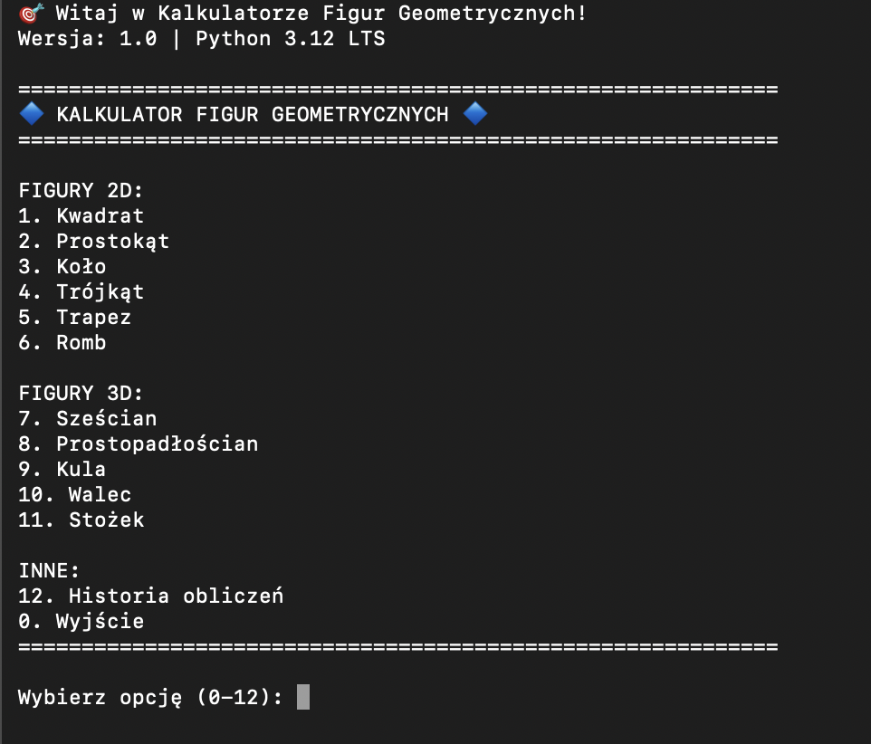
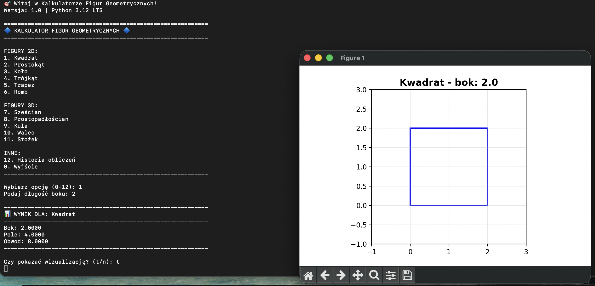
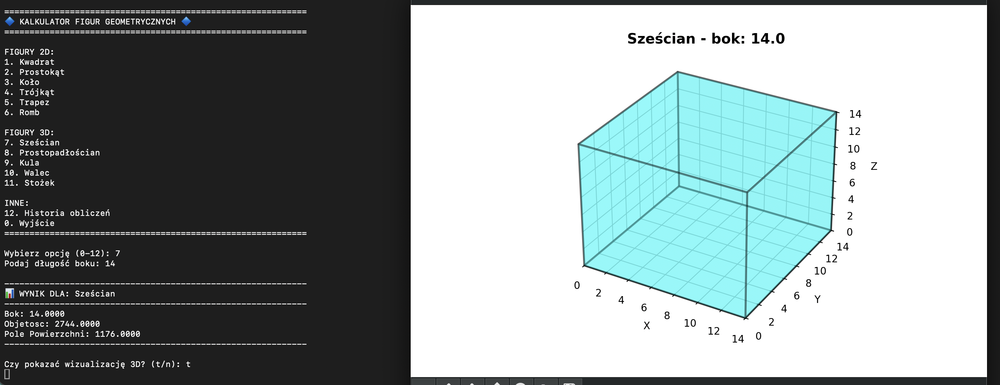

# geometry-viz-cli


A command-line geometry calculator with matplotlib visualization. Computes area, perimeter, volume, and surface area for 11 geometric shapes (6 two-dimensional and 5 three-dimensional) and renders them graphically.

## Screenshots

### Main Menu

<p align="center">
  
</p>

<p align="center">
  <sub>Interactive CLI menu with 6 flat shapes, 5 spatial shapes, and calculation history</sub>
</p>

### 2D Visualization — Square

<p align="center">
  
</p>

<p align="center">
  <sub>Square calculation (side = 2) with area, perimeter, and matplotlib 2D plot</sub>
</p>

### 3D Visualization — Cube

<p align="center">
  
</p>

<p align="center">
  <sub>Cube calculation (side = 14) with volume, surface area, and interactive 3D render via mplot3d</sub>
</p>

---

## Features

- **11 geometric shapes** -- 6 flat and 5 spatial figures
- **2D shapes** -- Square, Rectangle, Circle, Triangle (Heron's formula), Trapezoid, Rhombus
- **3D shapes** -- Cube, Rectangular Prism, Sphere, Cylinder, Cone
- **Matplotlib visualization** -- 2D plots and 3D renders via `mplot3d`
- **Interactive CLI menu** -- guided shape selection and parameter input
- **Calculation history** -- review all calculations in the current session
- **Input validation** -- guards against invalid or negative dimensions
- **Colorful terminal output** -- ANSI-colored prompts and results
- **41 unit tests** -- covering all shapes and edge cases

## Tech Stack

| Component | Technology |
|-----------|------------|
| Language | Python 3.10+ |
| Visualization | matplotlib, mplot3d |
| Numerical computing | NumPy |
| Testing | unittest |

## Getting Started

### Prerequisites

- Python 3.10 or higher
- pip

### Installation

```bash
git clone https://github.com/selter2001/geometry-viz-cli.git
cd geometry-viz-cli
pip install matplotlib numpy
```

### Running

```bash
python3 kalkulator_geometryczny.py
```

### Tests

```bash
python3 -m pytest
```

## Supported Shapes

| Category | Shape | Computed Properties |
|----------|-------|---------------------|
| 2D | Square, Rectangle | Area, Perimeter |
| 2D | Circle | Area, Circumference |
| 2D | Triangle | Area (Heron), Perimeter |
| 2D | Trapezoid, Rhombus | Area, Perimeter |
| 3D | Cube, Rectangular Prism | Volume, Surface Area |
| 3D | Sphere, Cylinder, Cone | Volume, Surface Area |

## Architecture

The application is built around a single class, `KalkulatorGeometryczny`, in one file:

```
geometry-viz-cli/
├── kalkulator_geometryczny.py   # Main application -- logic, UI, visualization
├── tests/                       # Unit tests
└── README.md
```

The class encapsulates menu handling, input validation, computation, history, and matplotlib rendering. Each shape has dedicated methods for calculation and visualization -- 2D shapes on standard axes, 3D shapes via `mpl_toolkits.mplot3d`.

## Author

**Wojciech Olszak** -- [github.com/selter2001](https://github.com/selter2001)

## License

This project is licensed under the MIT License.

---

# geometry-viz-cli


Konsolowy kalkulator geometryczny z wizualizacją matplotlib. Oblicza pole, obwód, objętość i pole powierzchni dla 11 figur geometrycznych (6 płaskich i 5 przestrzennych) oraz renderuje je graficznie.

## Zrzuty ekranu

### Menu główne

<p align="center">
  
</p>

<p align="center">
  <sub>Interaktywne menu CLI z 6 figurami płaskimi, 5 przestrzennymi i historią obliczeń</sub>
</p>

### Wizualizacja 2D — Kwadrat

<p align="center">
  
</p>

<p align="center">
  <sub>Obliczenie kwadratu (bok = 2) z polem, obwodem i wykresem 2D matplotlib</sub>
</p>

### Wizualizacja 3D — Sześcian

<p align="center">
  
</p>

<p align="center">
  <sub>Obliczenie sześcianu (bok = 14) z objętością, polem powierzchni i interaktywnym renderem 3D mplot3d</sub>
</p>

---

## Funkcjonalności

- **11 figur geometrycznych** -- 6 płaskich i 5 przestrzennych
- **Figury 2D** -- Kwadrat, Prostokąt, Koło, Trójkąt (wzór Herona), Trapez, Romb
- **Figury 3D** -- Sześcian, Prostopadłościan, Kula, Walec, Stożek
- **Wizualizacja matplotlib** -- wykresy 2D i rendery 3D przez `mplot3d`
- **Interaktywne menu CLI** -- krokowy wybór figury i wprowadzanie parametrów
- **Historia obliczeń** -- przegląd wszystkich obliczeń w bieżącej sesji
- **Walidacja danych** -- zabezpieczenie przed niepoprawnymi wymiarami
- **Kolorowy terminal** -- podświetlane komunikaty i wyniki ANSI
- **41 testów jednostkowych** -- pokrywających wszystkie figury i przypadki brzegowe

## Stos technologiczny

| Komponent | Technologia |
|-----------|-------------|
| Język | Python 3.10+ |
| Wizualizacja | matplotlib, mplot3d |
| Obliczenia numeryczne | NumPy |
| Testy | unittest |

## Uruchomienie

### Wymagania

- Python 3.10 lub nowszy
- pip

### Instalacja

```bash
git clone https://github.com/selter2001/geometry-viz-cli.git
cd geometry-viz-cli
pip install matplotlib numpy
```

### Uruchomienie aplikacji

```bash
python3 kalkulator_geometryczny.py
```

### Testy

```bash
python3 -m pytest
```

## Obsługiwane figury

| Kategoria | Figura | Obliczane właściwości |
|-----------|--------|----------------------|
| 2D | Kwadrat, Prostokąt | Pole, Obwód |
| 2D | Koło | Pole, Obwód |
| 2D | Trójkąt | Pole (Heron), Obwód |
| 2D | Trapez, Romb | Pole, Obwód |
| 3D | Sześcian, Prostopadłościan | Objętość, Pole powierzchni |
| 3D | Kula, Walec, Stożek | Objętość, Pole powierzchni |

## Architektura

Aplikacja opiera się na pojedynczej klasie `KalkulatorGeometryczny` w jednym pliku:

```
geometry-viz-cli/
├── kalkulator_geometryczny.py   # Główna aplikacja -- logika, UI i wizualizacja
├── tests/                       # Testy jednostkowe
└── README.md
```

Klasa zawiera obsługę menu, walidację danych, obliczenia, historię i rendering matplotlib. Każda figura posiada dedykowane metody -- figury 2D rysowane są na standardowych osiach, a figury 3D renderowane przy użyciu `mpl_toolkits.mplot3d`.

## Autor

**Wojciech Olszak** -- [github.com/selter2001](https://github.com/selter2001)

## Licencja

Projekt jest objęty licencją MIT.
